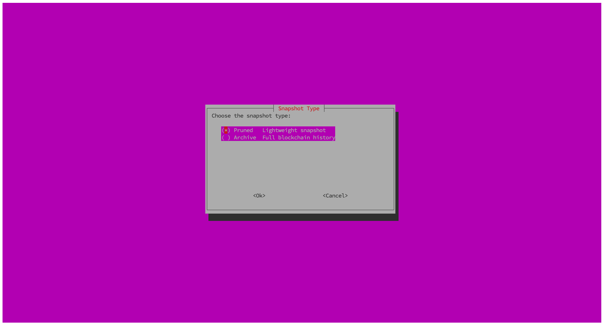

# story-snapshot-script

## Automated Snapshot Restoration Script

We’ve created a **convenient script** that simplifies the process of downloading and applying snapshots for your Story and Geth nodes. The script:

- Prompts you to specify the **service names** for the execution and consensus layers, with default values provided.
- Allows you to **choose between pruned and archive snapshots** for both Story and Geth nodes.
- Automatically **stops the services**, **downloads and extracts the chosen snapshot**, and **restarts the services** after the restoration process is complete.

### Usage:

1. The script will ask for the **execution** and **consensus service names**, defaulting to `story-geth` and `story`.
2. You’ll select whether to apply a **pruned** or **archive** snapshot.
3. It will manage everything—**downloading, extracting snapshots**, and **restarting services**—so your nodes are up and running with minimal effort.

This automation ensures a **quick recovery or setup** for your nodes using the latest snapshots available. You can run the script directly by using the following command:

```bash
curl -s https://raw.githubusercontent.com/encapsulate-xyz/story-snapshot-script/refs/heads/main/node_tui.sh | bash
```
## Visual Overview

The following provides a visual guide on how to interact with the TUI-based script for setting up your Story node. You’ll be prompted to enter service names, and finally, you’ll choose the appropriate snapshot type.

### Choose Service Name
| **Enter Geth Service Name**                                   | **Enter Story Service Name**                                 |
|---------------------------------------------------------------|--------------------------------------------------------------|
|  |  |

### Select Snapshot Type


These images demonstrate the simple, interactive steps to set up and restore your Story protocol node with ease.